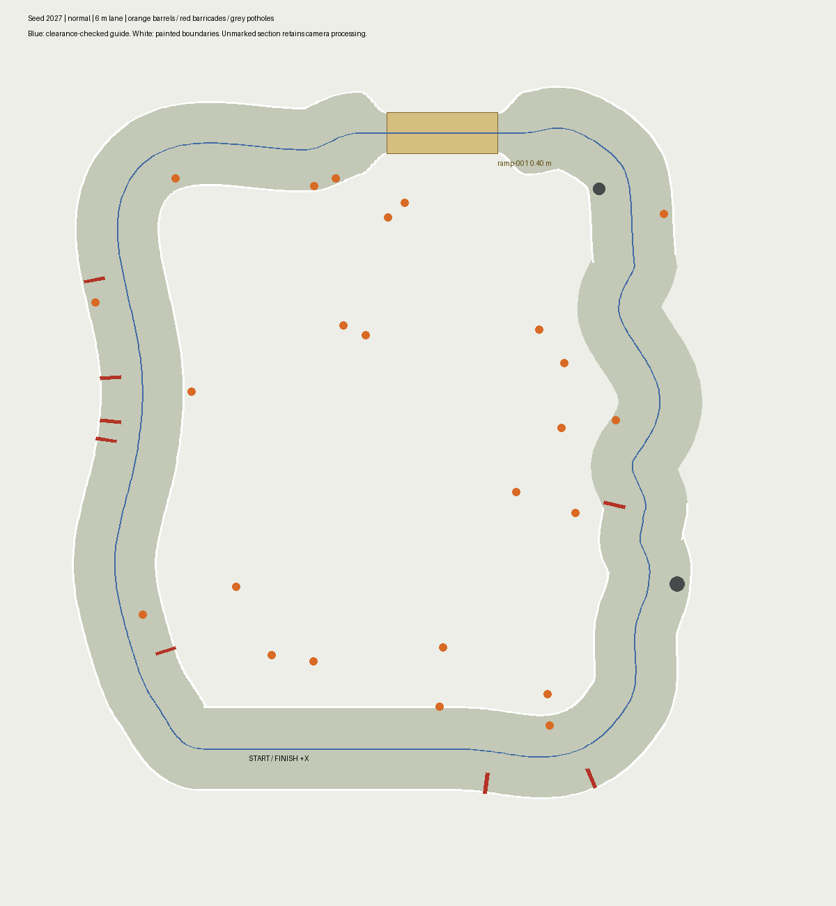

# Course layout update — September 16, 2026

The generated course now places the ramp across the far side of the loop,
opposite the start: entrance `(18, 44.5)` metres, facing ROS yaw pi. Its existing
3 m width, 0.4 m height and white edge markings are retained. The far straight
is flattened onto the ramp center, and obstacle reservations move with it.

Barrels are sampled across the enclosed field and surrounding lane corridor,
rather than two narrow strips beside the centerline. Placement still excludes
the start, ramp approaches, overlapping obstacles and the clearance-checked
guide route. This remains a solvable practice fixture, not unconstrained
random blockage or a claim of general obstacle-avoidance capability.

Seed 2027 uses 28 mission waypoints instead of 82. Straight sections use up to
8 m spacing; turns are split when chord deviation exceeds 0.6 m, and proposed
chords are checked against obstacles. Ramp alignment and surface-mode transitions
retain explicit goals. The dense route remains available to the continuous lap
audit, so reducing goals does not authorize a shortcut back to the start.

Validation: 12 course geometry tests passed on Ubuntu Python, including multiple
seeds/difficulties, obstacle clearance, broad barrel coverage, ramp reservations,
paint placement and sparse route geometry. Previous 82-checkpoint results
describe the old layout.

## Live validation

Windows Unity with Docker Jazzy completed a fresh, uninterrupted 28/28 lap,
including the relocated ramp and return to start. All 12 [audit checks](evidence/course-layout/audit.json)
passed: no resets, recording gaps or line interventions; maximum recorded speed
2.2 m/s; minimum sampled clearance 0.591 m and conservative swept clearance
0.444 m. The final [sensor check](evidence/course-layout/integration.json) passed
all seven checks (RGB 12.89 Hz, depth 8.90 Hz, lidar 5.05 Hz).

Initial debugging runs exposed planning beyond observed terrain when three
sparse goals were sent at once, plus completion of an old controller path during
goal preemption. The mission now limits extra goals to 10.5 m from the robot and
reissues unvisited goals after early completion, preserving the physical audit
and 90-second no-progress timeout. Unmarked intervals come from dense route
modes, independent of the reduced goal count. The resumed debugging run had
recording gaps and was not accepted; the final uninterrupted run is the evidence
linked above. A startup sensor-rate failure was also retained separately from
the successful warmed-up check.

The Docker image was rebuilt with the final scripts. Unity loads this geometry
from its manifest; no Unity C# or player rebuild was required. Linux runtime was
not rerun for this layout change. This remains ideal simulation validation.

