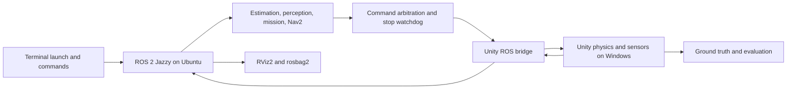

# IGVC simulation implementation plan

Current autonomy change: [sensor-led navigation](SENSOR_AUTONOMY.md) replaces
route-informed mission control with observed-costmap local goals and six broad
GPS destinations. Earlier lap evidence below belongs to guided regression.

Latest reference refinement: [sector-based course](REFERENCE_COURSE.md) replaces
midfield barrel scattering with alternating passages and random colored barrels
around separate line gaps flanking the painted ramp. Seed 2027 uses 31 goals.

Current layout slice: [sparse course guidance](COURSE_LAYOUT_UPDATE.md) moves the
ramp opposite the start, distributes barrels throughout the field and reduces
seed-2027 mission goals from 82 to 28. Earlier evidence below retains its original
layout and checkpoint count.

Latest gate evidence: [ramp-edge/surface perception](RAMP_EDGE_PERCEPTION.md) completed all82 ordered checkpoints on seed2027 and returned to start; independent audit passed without reset/gaps/lineguardblocks. Ramp-edgepaint now narrows onto the raised surface. Connected observed shallow surfaces replace global-plane obstacle extrapolation; RGB uses depth support. This resolves the previously demonstrated ramp blockage in this controlled course. General terrain, sparse-edge projection accuracy and hardware calibration remain open.

Map integration: [procedural ramp](COURSE_RAMP.md) now uses the terrain/suspension model in new variants, with reserved obstacle clearance and ordered guide checkpoints. Seed 2027 now has 82 checkpoints. Manual course traversal passed; the previous 78/78 flat-course run is archived and does not close the autonomous ramp gate.

Current terrain gate: [moving perception baseline](TERRAIN_PERCEPTION.md) confirms confident single-plane fits can mark ramp/floor as obstacles, and RGB can report lanes on the unpainted bench. Capture/replay and managed perception-only sessions are implemented. Next: spatially supported ground classification and depth-consistent RGB projection; motion passes do not close this gate.

Caster update: [motion-aligned swivel](CASTER_SWIVEL.md) now rotates both rear caster assemblies and publishes their existing joint states, with flat-pad and combined suspension/ramp validation. This remains a geometry/kinematic approximation. Steering-dependent contact locations, wheel rolling, measured friction/trail, full contact physics and autonomous ramp perception/planning remain open phase-2/phase-6 work.

Latest suspension slice: [rear caster compliance](CASTER_SUSPENSION.md) is implemented in the experimental terrain bench. Two bounded slider travels share a damped rear pitch state; 0.6 and 2.2 m/s live ramp/bump checks passed with exact-stamp caster TF comparisons. This advances the caster approximation portion of phase 2, but does not close measured-geometry, full contact physics, traction or autonomous-ramp gates. The normal course retains ideal planar motion. Earlier full-loop evidence below predates the suspension-joint addition.

Status: ideal Unity/ROS transport, robot import, seeded courses, ordered full-loop Nav2 missions, RGB lane/hazard perception and metric depth are implemented. Terrain-relative depth filtering and shared RGB lane/hazard projection passed 42 perception tests, rendered fixtures, live projection checks and the latest seed-2027 full-loop regression (78/78, no pauses, recoveries or line-guard blocks) after explicit steady timers fixed system-clock correction stalls. See [depth evidence](DEPTH_CAMERA.md) and [timing evidence](ROS_TIMING.md). [RGB lane/hazard projection](TERRAIN_LANES.md) now consumes a fresh preceding depth plane without fixed-Z fallback. A single locally stationary plane does not establish nonplanar-transition handling or complete ramp navigation. The [experimental terrain-body bench](TERRAIN_BODY.md) passed slow/fast manual support checks; dynamic body TF also passed the normal planar-course regression. Terrain, drive and course players were rebuilt. This does not establish autonomous ramp traversal. Phase 2 geometry/contact and hardware-fidelity gates remain open. Date: 2026-09-09. See [the runbook](RUNBOOK.md), [procedural courses](PROCEDURAL_COURSES.md) and [agent workflow](AGENT_WORKFLOW.md). Full-loop fixture success does not establish competition compliance or calibrated hardware behavior.

Confirmed target: IGVC 2027 AutoNav only, OAK-D Pro depth camera and RPLIDAR A1. WSL2/Jazzy base installation is confirmed locally. Self Drive-specific behaviors such as traffic-light interpretation, parking and passing rules are outside this plan's scope.

The user supplied the [2026 rulebook](https://www.igvc.org/2026rules.pdf) as a reference after confirming AutoNav. This does not change their previously stated 2027 target. Before implementing competition scenarios, compare Sections I and II of that reference with the pinned 2027 rulebook and record relevant differences. Keep any 2026 regression profile explicitly versioned; never silently mix dimensions, scoring or qualification rules across years.

## Intended result

The camera is mounted on its extracted pole-top pitch bracket, defaults to 10° down and has terminal control, coherent optical TF, RGB and ideal metric depth with their own paired CameraInfo. Camera-specific checks are recorded in [camera evidence](CAMERA_MOUNT.md) and [depth evidence](DEPTH_CAMERA.md). Body attitude/contact, nonplanar terrain and measured stereo uncertainty remain future work.

Latest implementation slice: [R3-a ideal drive](R3A_DRIVE.md) passed 26 live checks, with reduced Unity visuals and verified axle/base/wheel/caster frames. Physical forward is confirmed toward the big drive wheels; casters are rear. Phase 2 physical geometry/contact gates remain open; ideal movement is not a validated physics model.

A reproducible Unity world runs the robot, terrain, contacts, and sensor generation. ROS 2 Jazzy runs the robot description, estimation, perception, mission logic, and Nav2. RViz2 displays the robot, TF, lidar, RGB/depth, point clouds, odometry, paths, and costmaps. Terminals start sessions, select scenarios, drive manually, send navigation goals, reset, inspect health, and record results.

The first useful deliverable is a robot driving on a simple test pad from ROS commands with correct TF, odometry, scan data, and RViz displays. The complete deliverable adds calibrated camera/depth simulation, Nav2, IGVC perception and missions, scenario variations, and repeatable evaluation.

## Architecture and decisions

1. **Host candidate:** Windows Unity with Ubuntu 24.04 WSL2 for ROS. Both already have local installation evidence. Ubuntu 24.04 is a supported Jazzy platform. Keep DDS participants inside Ubuntu initially and use one explicit TCP connection to Unity. Prove Windows-to-WSL addressing, reconnects, firewall behavior, and RViz through WSLg. If graphics or networking fail the milestone, assess native Ubuntu or a separate Linux host before building more features. [ROS installation](https://docs.ros.org/en/jazzy/Installation/Ubuntu-Install-Debs.html), [WSL networking](https://learn.microsoft.com/en-us/windows/wsl/networking).
2. **Unity candidate:** installed editor 6000.3.23f1. The initial transport fixture uses the built-in rendering pipeline; URP remains a later deliberate migration because the current camera uses `Camera.Render`. Freeze exact editor, packages, graphics API, and build target after the compatibility proof. Use a rendered player for camera operation; a `-nographics` run cannot be assumed to generate camera images.
3. **Bridge candidate:** Unity ROS-TCP-Connector plus the ROS-TCP-Endpoint ROS 2 branch, pinned to tested commits. Their existence does not establish Unity 6/Jazzy support. Test generated messages, services, QoS, queues, and image throughput before adoption. Keep Nav2 actions on the ROS side; Unity only needs motion, sensors, clock, and simulator controls. The inspected endpoint publisher uses queue depth rather than an explicit per-topic QoS profile; plan a small owned patch/adapter if needed. If the bridge cannot meet requirements, evaluate a maintained native ROS 2 binding or a small bounded protocol with a ROS-side adapter. Do not migrate ROS distributions just to fit an old tutorial. [Connector](https://github.com/Unity-Technologies/ROS-TCP-Connector), [ROS 2 endpoint](https://github.com/Unity-Technologies/ROS-TCP-Endpoint/tree/main-ros2), [publisher implementation](https://raw.githubusercontent.com/Unity-Technologies/ROS-TCP-Endpoint/main-ros2/ros_tcp_endpoint/publisher.py).
4. **Description authority:** normalized Xacro/URDF and robot configuration are canonical. Generate/stage Unity imports from them; never independently edit two robot descriptions. SolidWorks originals remain external and unchanged. Start with existing STL exports; use STEP/CAD re-export only for missing geometry or improved segmentation. The URDF importer is a candidate, with its generated articulation inspected before use. [Importer](https://github.com/Unity-Technologies/URDF-Importer).
5. **Physics:** first use a deliberately ideal differential-drive mode to prove ROS integration. Then use articulated driven wheels and simplified body contacts, with caster treatment explicitly chosen and documented. The physics backend may be replaced without changing ROS topics. Wheel odometry must come from simulated encoders in realistic mode, not the Unity transform.
6. **Autonomy:** Nav2 supplies navigation components, while lane perception and IGVC mission logic are separate ROS packages. Painted lines need camera perception and a traversability/costmap representation; lidar alone will not detect paint. Use ground-truth labels only for scoring or an explicitly named oracle test mode.

## Milestones and exit gates

The user-supplied [SoonerRobotics reference review](SOONER_REFERENCE_REVIEW.md) informs implementation: use spline-based course authoring, transport-independent camera modules, asynchronous GPU readback, bounded processing and terminal scene selection. Their custom FlatBuffers/CAN transport, ZED/VectorNav models and transform-based drivetrain do not replace our Jazzy contract, OAK-D Pro/RPLIDAR models or drivetrain validation. Retain the current foundation; direct code/asset reuse requires identified reuse terms and component-level validation.

The follow-up [2025/2026 autonomy review](SOONER_AUTONOMY_REVIEW.md) adds a concrete Jazzy reference from their 2025 stack. Add shared autonomy launch profiles for simulation/replay/later hardware, an OpenCV perception baseline with debug outputs, and stamped metric lane observations feeding a dedicated Nav2 layer. Keep lane clearing separate from lidar ray clearing. Add grid metadata checks, calibration/terrain projection tests, and recorded-sensor replay before course tuning. Their 2026 custom C# simulator client clarifies the newer transport but does not replace ROS or Nav2.

Effort ranges are rough engineering estimates for one contributor, excluding missing hardware information and upstream incompatibility. They are not a calendar commitment. A failed gate produces a recorded diagnosis and revised decision before dependent work begins.

| Phase | Work and deliverables | Required evidence to proceed | Effort |
|---|---|---|---|
| 0. Freeze requirements | Confirm host preference, robot forward direction, sensor revisions/mounting/settings, autonomy reuse, target computer and performance profile. Record version candidates and a source manifest; compare the supplied 2026 reference with the 2027 AutoNav requirements. | Decisions and unresolved assumptions recorded; IGVC 2027 rulebook version pinned and relevant differences recorded. | 0.5–1 day |
| 1. Prove transport | Minimal Unity scene; Jazzy endpoint; clock and velocity round trip; representative Image, LaserScan, JointState and control service payloads; install missing ROS tools during implementation. | Ten-minute exchange, clean restart/reconnect, correct stamps, bounded queues, RViz opens in WSLg. Test control while images stream. Pin passing versions. | 1–3 days |
| 2. Normalize robot | `igvc_description`, valid package paths, simplified visual/collision meshes, reviewed inertia and units, sensor/optical frames, differential-drive geometry, regenerated import. | URDF parses; all meshes resolve in Linux; Unity/RViz frame axes agree; measured dimensions match; robot stable on flat ground. Validate wheel signs and caster approximation. | 2–4 days |
| 3. Close motion loop | Terminal teleop, command arbitration, acceleration/speed limits, watchdog, joint state feedback, encoder odometry, IMU, TF, sim time, reset. | Straight, reverse, rotate and arc tests; same pose convention in RViz; no duplicate TF authority; stale commands stop within proposed 0.5 s wall time. Separate ideal and encoder-based modes. | 2–4 days |
| 4. Validate sensors | Lidar, RGB, depth, CameraInfo, point cloud conversion, IMU, optional GNSS; RViz config; rates/noise/dropouts; bounded async camera capture. | Known-wall scan, known-plane depth and overlapping-surface occlusion tests; synchronized RGB/depth; no mirrored images; correct optical axes, encodings, units and acquisition timestamps. Proposed ideal depth/scan error <= 2 cm on fixtures at 1–5 m. | 3–6 days |
| 5. Integrate Nav2 | Localization, footprint, obstacle/voxel and inflation layers, planner/controller selection, lifecycle launch, terminal goals/cancel, diagnostics and bag recording. | Proposed 10 seeded test-pad missions all complete within 0.25 m goal position tolerance, without collisions; blocked-goal recovery and cancel verified. Store parameter snapshots and bags. | 2–4 days |
| 6. Build IGVC behavior | Versioned AutoNav course profile; lanes, obstacles, slopes/ramps as applicable, waypoint missions, vision-derived boundaries, permitted localization, scoring and scenario seeds. | Rule-to-test traceability; lane/obstacle/waypoint metrics; autonomy gets only allowed sensor inputs. Derive competition thresholds from the pinned 2027 AutoNav rules. | 4–8 days |
| 7. Package and regress | Player build, terminal wrapper, setup/runbook, smoke suite, sensor/load/failure scenarios, reproducibility manifest, performance report. | Fresh checkout bringup; ten-minute full-sensor run at real-time factor >= 0.95 and command age p95 < 100 ms on the named test host; reconnect, pause/reset and sensor-loss runs recorded. | 2–4 days |

Total planning range: roughly 15–30 engineering days. High-fidelity stereo artifacts, sophisticated outdoor perception, and transferring performance to hardware can extend this substantially.

## Model preparation detail

Preserve source checksums and mesh provenance. Rename the ROS package, not the originals. Validate units and physical forward direction using measured dimensions and rendered axes. Resolve the exported mass of 96.86 kg before tuning motors. Inspect inertia symmetry/positive definiteness and center of mass. Determine wheel radius from geometry and real measurements; Y separation alone is not a complete drivetrain specification.

Remove tiny fasteners/internal electronics from runtime visuals where they do not affect sensing; retain sensor occluders and exterior shape. Use primitive/compound convex collision geometry for the body and suitable wheel contact shapes. Do not run the 888,264-triangle visual export as dynamic collision geometry. Initial visual budget: <= 150k triangles for the robot, revisable from profiling rather than a correctness requirement.

Add caster wheel spin joints if physical caster fidelity is needed, or document an approximation and its limits on slopes. Avoid combining a moving transform controller and dynamic rigidbody/articulation control on the same robot. Keep drivetrain math/sign tests independent of Unity import orientation.

## Localization and competition modes

- `test_pad_oracle`: exact odometry for transport/geometry checks only, visibly tagged in results.
- `mapped_lab`: encoder/IMU estimation, a known map and AMCL; optionally separate online SLAM runs for development.
- `igvc`: sensor-driven localization and rolling perception/costmaps with waypoint logic. If GNSS is required, model a declared geographic origin, noise/dropouts and heading conventions; integrate GNSS with estimation instead of substituting exact coordinates.

Only one localization mode is active. Map-based lab success is not evidence of IGVC compliance. The 2027 rulebook, 7 July 2026 version, restricts mapping/course memorization and requires onboard processing during competition. Keep mapped-lab mode separate; clarify permissible transient local costmap observations before competition deployment. Terminal control and external RViz are development tools. AutoNav qualification includes lane following, obstacle avoidance and a two-metre-diameter waypoint target. Build rule-to-test traceability from Sections I and II, and recheck revisions before course implementation. [2027 rulebook](https://gl-systems-technology.net/uploads/3/4/7/2/34727963/igvc_2027_rules_version_7_july_26.pdf).

GNSS hardware has not been identified. Phase 0 must settle the real robot's waypoint-localization approach; optional simulated GNSS is not a claim that a receiver exists on the robot.

Nav2 integration requires a coherent transform chain, sensor observations, odometry and configured robot footprint. Start with a simple differential-drive controller/planner pairing and select alternatives based on turning space and test results. Use the full projected body footprint, not just wheel track. [Jazzy setup guide](https://docs.nav2.org/jazzy/configuration_and_development/first_time_robot_setup_guide/), [TF requirements](https://docs.nav2.org/jazzy/configuration_and_development/first_time_robot_setup_guide/transformation/setup_transforms/).

## Fidelity and risk boundaries

**OAK-D Pro:** target RGB, stereo-derived depth, paired CameraInfo and point clouds. Add left/right monochrome streams only if the autonomy stack consumes them. Use the camera's integrated IMU as the first candidate for `/imu/data`, pending confirmation that the team uses it and calibration of its frame. Confirm exact camera variant, intrinsics, depth alignment, resolution and FPS from the device/driver. The initial 640x480/15 Hz profile is a transport test, not a hardware specification. Luxonis documents active stereo behavior, so outdoor light, texture and invalid-depth scenarios belong in later fidelity work. [OAK-D Pro](https://docs.luxonis.com/hardware/products/OAK-D%20Pro), [stereo configuration](https://docs.luxonis.com/hardware/platform/depth/configuring-stereo-depth/).

**RPLIDAR A1:** use a planar 360-degree LaserScan. Start with 5.5 Hz and a provisional 0.15–12 m range, then match the exact A1 hardware revision and configured scan mode; older revisions can have shorter range. Include scan acquisition duration, beam timing, robot self-occlusion, missing returns and outdoor degradation based on recorded hardware data. Do not simulate an ideal unlimited-range lidar or assume every scan point is acquired simultaneously in realistic mode. [SLAMTEC specifications](https://www.slamtec.com/en/lidar/a1spec), [revision-dependent datasheet](https://bucket-download.slamtec.com/60ef2c5a82129bf7213f0ff5d51e732d1c124c3a/LD108_SLAMTEC_rplidar_datasheet_A1M8_v2.3_en.pdf).

Camera simulation begins with calibrated pinhole RGB and metric depth. It does not initially reproduce a camera vendor's stereo matcher, firmware, exposure response, or hardware driver. Add distortion, exposure variation, invalid depth, motion effects and correlated noise in measured stages. Match ROS message contracts rather than trying to run physical USB drivers against synthetic devices.

A 640x480 RGB8 plus 32FC1 depth pair at 15 Hz produces approximately 32.3 MB/s before framing; generated point clouds add more. Start at that profile, generate clouds in ROS where practical, and benchmark before raising resolution or adding cameras. Bound queues and drop stale sensor frames so imagery cannot indefinitely delay commands. Split control and image transport if measurements justify it.

Use fixed physics steps and seeded scenario/noise generation, but do not promise bit-identical PhysX results across machines. Store tolerance-based regression metrics. Ground-truth paths, collision counts, lane crossings, goal completion, travel time, localization error, message age, dropped frames and real-time factor form the evaluation report.

The simulator's emergency-stop control is a latched simulated stop and test feature. It is not evidence that the physical robot's hardware E-stop satisfies competition requirements.

## Implementation start boundary

This planning delivery creates documentation and repository hygiene only. The first implementation task is Phase 1 after resolving Phase 0 requirements as far as needed. No package installations, robot imports, CAD edits, scenes, or runtime code are part of this delivery.
