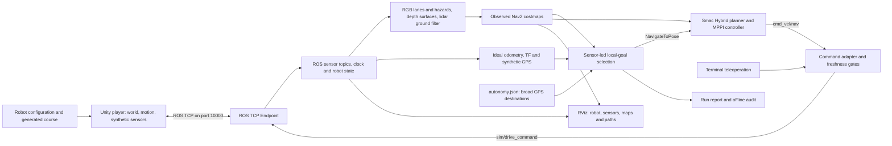

# IGVC Simulation — Master Project Guide

**Start here when joining the project.** This guide explains what runs, how the
pieces communicate, where to edit them, and how to judge the result.

Reviewed against the working-tree source on **2026-09-23**. Target: **IGVC 2027
AutoNav**, Unity **6000.3.23f1**, Ubuntu **24.04**, ROS 2 **Jazzy**. This describes
the current checkout; it does not imply that every local change is already in a
published release. Relative links work in the repository and on GitHub.

## Contents

- [1. First reading and common tasks](#first-reading)
- [2. What is implemented and what remains experimental](#status)
- [3. Architecture and one navigation cycle](#architecture)
- [4. Repository map and sources of truth](#repository)
- [5. Run the project](#run)
- [6. ROS topics, commands, frames, and clocks](#interfaces)
- [7. Find the subsystem you want to change](#change-map)
- [8. How to edit parameters](#parameters)
- [9. Apply changes: regenerate, rebuild, or restart](#apply)
- [10. Testing and interpreting evidence](#validation)
- [11. Troubleshooting](#troubleshooting)
- [12. Team workflow, releases, and dependencies](#team)
- [13. Glossary](#glossary)
- [14. Maintain this guide](#maintenance)

Companion references:

- **[Linked file and document index](FILE_INDEX.md)** — repository entry points,
  source-file responsibilities, utilities, tests, and the complete topic-document index.
- **[ROS, navigation, and perception parameters](guide/ROS_PARAMETERS.md)** —
  exact names, units, current values, interactions, and verification methods.
- **[Unity, robot, and course editing](guide/UNITY_AND_COURSE.md)** — world
  generation, scene builders, geometry, mounts, camera controls, and terrain settings.

<a id="first-reading"></a>
## 1. First reading and common tasks

| Your goal | Read or open next |
|---|---|
| Run an existing checkout | [Run modes below](#run), then the platform setup in [README](../README.md) |
| Understand the system without running it | [Architecture](#architecture), [interfaces](#interfaces), [file index](FILE_INDEX.md) |
| Change barrels, lanes, the ramp, or randomization | [Unity/course reference](guide/UNITY_AND_COURSE.md) and [generator](../tools/generate_course_variant.py) |
| Change speed, heatmap clearance, or backing up | [ROS parameter reference](guide/ROS_PARAMETERS.md) and [current navigation configuration](../ros2/src/igvc_navigation/config/local_navigation.yaml) |
| Work on autonomous navigation | [Sensor-led design and evidence](SENSOR_AUTONOMY.md), [mission coordinator](../tools/sensor_course.py), [observed navigation](../tools/observed_navigation.py) |
| Fix a sensor, mount, or TF problem | [Robot/course reference](guide/UNITY_AND_COURSE.md), [camera mount](CAMERA_MOUNT.md), [lidar mount](LIDAR_MOUNT.md) |
| Diagnose a stopped robot | [Troubleshooting](#troubleshooting), stop reason, saved progress, and observations |
| Add a feature or hand work to another agent | [Team workflow](#team), [AGENTS.md](../AGENTS.md), [agent workflow](AGENT_WORKFLOW.md) |
| Find the meaning of an unfamiliar file | [File index](FILE_INDEX.md) |

Suggested onboarding: read sections 2–4, run the sensor/TF check in section 10,
inspect the camera and scan in RViz, and only then start a mission. An open Unity
window alone does not establish a working ROS connection.

<a id="status"></a>
## 2. What is implemented and what remains experimental

The project is an **idealized simulation and integration fixture**, with CAD
visuals and an experimental sensor-led navigator. It is not a calibrated digital
twin or proven competition-ready autonomy.

| Area | Current implementation | Evidence and limits |
|---|---|---|
| Host and ROS integration | Unity player on the host; ROS and RViz in Docker or native WSL | [Docker validation](DOCKER_VALIDATION.md), [native commands](NATIVE_AUTONAV.md). Native controller overlay was built and tested locally; platform startup is not a lap test. |
| Robot | Canonical R3-a description, driven front wheels, rear casters, mounted camera and lidar | [Drive](R3A_DRIVE.md), [robot inspection](ROBOT_INSPECTION.md). Motion remains kinematic; measured drivetrain/contact calibration is incomplete. |
| Sensors | Synthetic lidar, rendered RGB, ideal metric depth, TF/joints, ideal odometry and synthetic GPS | [Depth](DEPTH_CAMERA.md), [GPS](GPS_WAYPOINTS.md). These are not hardware drivers or realistic stereo/GNSS noise models. |
| Terrain | Procedural ramp, body attitude/support and caster approximations | [Ramp](COURSE_RAMP.md), [suspension](CASTER_SUSPENSION.md). No claim of full tire/contact/friction dynamics. |
| Sensor-led autonomy | Six broad destinations for the current seed; observed paint, depth and lidar; Smac Hybrid planner and MPPI controller | [Current autonomy record](SENSOR_AUTONOMY.md). A first-time sensor-led full lap is **not verified**. |
| Guided regression | Generated route/checkpoints and ordered-route audit | [Full course](FULL_COURSE.md). Earlier 78/82-checkpoint successes are historical guided tests, not evidence that the current sensor-led mode solved the course. |
| Narrow inflation | Both costmaps use 0.30 m inflation with a patched MPPI footprint check | [C++ regression result](evidence/sensor-autonomy/point3-mppi-tests.xml), [partial lap audit](evidence/sensor-autonomy/point3-partial-audit.json). Reducing inflation does not shrink the robot. |
| Ramp descent filtering | Depth-supported filtering separates observed ground returns from lidar obstacle marking | [Descent experiment](RAMP_DESCENT_FILTER.md). Controlled traversal evidence is not an autonomous full lap. |
| Linux support | Linux player and Docker launchers, X11/XWayland RViz support | [Linux validation](LINUX_VALIDATION.md). Tests on WSLg are not certification of every native Linux desktop/GPU. |

The current code enforces a **2.2 m/s** maximum command cap. Do not treat that
number, or any historical rulebook discussion, as certification of the 2027
rules. [PLAN.md](PLAN.md) tracks the intended gates and remaining fidelity work.

Some older documents contain accumulated experiment notes and superseded
waypoint counts. For current behavior, use the source linked here and the active
configuration. For a claimed result, read the evidence for that specific mode,
seed, configuration, and date.

<a id="architecture"></a>
## 3. Architecture and one navigation cycle



**Unity owns the simulated world and simulation clock.** It integrates ideal
motion, renders cameras, raycasts lidar, reports body/joint state and applies
simulator controls. `TransportProbe` is the historical class name; it also hosts
the current CAD/course mode. The visible camera used to look around the scene is
separate from the robot sensor camera.

**ROS owns perception, navigation and command authority.** The TCP endpoint
moves ROS messages between Unity and the ROS graph. The adapter converts ideal
ground truth into `/odom`/body TF and selects permitted motion commands. The
robot-state publisher derives link TF from the description and joint states.
Native and Docker modes run the same project ROS packages.

**One navigation cycle:**

1. RGB and metric depth arrive with acquisition timestamps and matching
   `CameraInfo`. Exact-time transforms place observations in `odom`.
2. Perception extracts painted boundaries and colored/dark hazards, classifies
   observed ground/depth obstacles, and filters supported ground hits from lidar
   obstacle marking. Raw lidar remains available for display and clearing.
3. Nav2 combines these observations into rolling local/global costmaps. The
   custom lane layer carries observed camera paint/hazard costs.
4. `sensor_course.py` combines the observed costmap, odometry, lane observations
   and a broad destination. Lane-pair proposals and bounded heading memory guide
   a forward arc search with the full footprint. A separate worker process keeps
   that search from monopolizing ROS callbacks.
5. The selected local goal goes to Nav2. Smac plans a feasible forward path;
   MPPI selects a motion command using path, goal and collision costs.
6. The adapter checks authority and freshness before publishing stamped drive
   commands to Unity. Unity independently limits motion and expires old commands.
7. If forward progress fails, the mission cancels the active goal before checking
   a straight backup. Recovery needs observed rear clearance and useful forward
   continuation. It can stop when no adequate maneuver is demonstrated.

### Keep world knowledge separate from navigation knowledge

| File or mode | What it contains | Who may use it |
|---|---|---|
| `course.json` | Complete generated geometry, boundaries, ramps and obstacles | Unity and offline scoring; not the sensor-led mission |
| `autonomy.json` | Origin, broad geographic destination regions and speed cap | Sensor-led mission; current seed uses six destinations |
| `mission.json` | Ordered guide/checkpoints and regression metadata | Explicit `guided-course` / `full_course.py` regression only |
| `overview.png` and gallery images | Privileged top-down course/route previews | Human inspection and offline evaluation |
| Saved `*.observations.json` | What a stopped navigator observed | Diagnosis and offline replay, not a new mission's prior map |

Do not feed generated centerlines, ideal obstacle locations, a prebuilt
occupancy map, or hidden boundary corrections into a test described as first-time
sensor-led navigation. Both current course launchers pass `--line-guard scoring`;
the sensor mission checks that mode. A saved-pose resume or a manual ramp test is
a diagnostic, not a fresh lap.

<a id="repository"></a>
## 4. Repository map and sources of truth

| Location | Purpose | Edit or regenerate? |
|---|---|---|
| [README.md](../README.md) | Platform prerequisites, download/build and launch commands | Edit when setup changes |
| [docs/](./) | Architecture, experiments, runbooks and saved compact evidence | This guide and the [file index](FILE_INDEX.md) organize it |
| [ros2/src/](../ros2/src/) | Six first-party ROS packages | Edit source here; installed copies are build output |
| [ros2/config/fastdds.xml](../ros2/config/fastdds.xml) | DDS transport configuration | Rebuild Docker/restart processes after changes |
| [unity/IGVCSim/](../unity/IGVCSim/) | Unity project, packages, settings and owned scripts/assets | Keep source and `.meta` files together |
| [Assets/IGVC/Runtime](../unity/IGVCSim/Assets/IGVC/Runtime/) | Motion, cameras, sensors, world loading and controls | Edit C#; rebuild the player |
| [Assets/IGVC/Editor](../unity/IGVCSim/Assets/IGVC/Editor/) | Scene/model builders and batch verification | Builders can overwrite generated scene edits |
| [tools/](../tools/) | Launchers, preparation, missions, audits and diagnostic scripts | Each tool's purpose is indexed; some command motion |
| [docker/](../docker/) and [Compose](../compose.yaml) | ROS image, launch composition, patch and container checks | Docker rebuild is needed for baked-in source |
| [tools/agents/](../tools/agents/) | Optional bounded Cursor review runner | Development support, not a runtime dependency |
| `artifacts/` | Generated courses, builds, logs, session ownership and local reports | Ignored output; do not make it the only copy of source or published evidence |
| External CAD/source downloads | Original SolidWorks and vendor inputs | Keep original files external and unchanged; see provenance |

The native ROS workspace installs under `~/igvc_ws`; its patched controller
overlay lives under `~/igvc_nav2_overlay`. Docker installs project packages under
`/opt/igvc/install` and the controller overlay under `/opt/nav2-patched/install`.
Changing these installed copies is a temporary experiment, not a reproducible
source change.

Generated robot visuals live in ignored `Assets/IGVC/GeneratedRobot`; imported
Sooner course assets live in ignored `Assets/IGVC/External`. Unity `Library`,
builds, ROS installs and local credentials are excluded by [.gitignore](../.gitignore).

<a id="run"></a>
## 5. Run the project

Complete the relevant [README prerequisites and initial build](../README.md)
first. Commands below run **from the repository root**. Use only one simulator
session at a time: native ROS and Docker compete for TCP port 10000 and must not
publish duplicate clocks/commands.

### Windows + Docker ROS

PowerShell terminal A:

```powershell
powershell -NoProfile -ExecutionPolicy Bypass -File .\tools\docker.ps1 start -Seed 2027
powershell -NoProfile -ExecutionPolicy Bypass -File .\tools\docker.ps1 rviz
```

Leave RViz open. Terminal B:

```powershell
powershell -NoProfile -ExecutionPolicy Bypass -File .\tools\docker.ps1 run python3 docker/verify_integration.py
powershell -NoProfile -ExecutionPolicy Bypass -File .\tools\docker.ps1 course -Seed 2027
```

`start` opens Unity and the ROS container; `course` starts autonomous motion.
The Windows wrapper owns a hidden WSL keep-alive, released by `stop`, so Docker
can remain active after short-lived launch commands return.

```powershell
powershell -NoProfile -ExecutionPolicy Bypass -File .\tools\docker.ps1 stop
```

### Windows + native WSL ROS

The patched native controller must be built once; follow
[NATIVE_AUTONAV.md](NATIVE_AUTONAV.md) for dependency/setup commands. Terminal A:

```powershell
powershell -NoProfile -ExecutionPolicy Bypass -File .\tools\igvc.ps1 variant-start -Seed 2027 -Visible
powershell -NoProfile -ExecutionPolicy Bypass -File .\tools\igvc.ps1 nav-start
powershell -NoProfile -ExecutionPolicy Bypass -File .\tools\igvc.ps1 rviz
```

Terminal B:

```powershell
wsl -d Ubuntu-24.04 -- bash tools/run_ros.sh python3 docker/verify_integration.py --report artifacts/checks/native-integration.json
wsl -d Ubuntu-24.04 -- bash tools/run_ros.sh python3 tools/sensor_course.py --mission artifacts/courses/seed-2027/autonomy.json --report artifacts/courses/seed-2027/native-sensor-run.json --timeout 600
```

Stop with `powershell -NoProfile -ExecutionPolicy Bypass -File .\tools\igvc.ps1 stop`.
Do not run `perception-start` beside `nav-start`: navigation already launches the
perception nodes. Use `perception-start` only for a visualization/diagnostic
session that is not running navigation.

### Native Linux desktop + Docker ROS

The Linux wrapper manages the Linux player, desktop permissions and Compose
overlay. From two terminals after the [Linux setup](../README.md#linux-setup-ubuntu-2404-x86_64):

```bash
# Terminal A
bash tools/docker.sh start --seed 2027 --difficulty normal
bash tools/docker.sh rviz

# Terminal B
bash tools/docker.sh run python3 docker/verify_integration.py
bash tools/docker.sh course --seed 2027 --difficulty normal
# When finished:
bash tools/docker.sh stop
```

The `docker.sh` name matters: this is a Linux **host with ROS in Docker**, not
the native WSL ROS workflow. Use the same seed for startup, mission and audit.

<a id="interfaces"></a>
## 6. ROS topics, commands, frames, and clocks

This is the **implemented** interface summary, checked against current source.
[ROS_INTERFACE.md](ROS_INTERFACE.md) also contains proposed future contracts;
its planned IMU/encoder/estimation entries are not a list of implemented sensors.

| Interface | Type / producer | Purpose |
|---|---|---|
| `/clock` | `rosgraph_msgs/Clock`, Unity | Simulation time; one authority |
| `/sim/ground_truth/odom` | `nav_msgs/Odometry`, Unity | Ideal pose input to the current bridge |
| `/odom`, `/tf`, `/tf_static` | Adapter and robot-state publisher | Navigation/visualization pose and link transforms |
| `/joint_states`, `/sim/body_transform` | Unity | Moving links and body attitude; `/sim/suspension_state` also reports caster state in that mode |
| `/scan` | `sensor_msgs/LaserScan`, Unity | Raw ideal lidar; display and costmap clearing |
| `/camera/color/image_raw`, `/camera/color/camera_info` | `Image` / `CameraInfo`, Unity | RGB8 image and paired calibration |
| `/camera/depth/image_raw`, `/camera/depth/camera_info` | `Image` / `CameraInfo`, Unity | Ideal `32FC1` depth in metres and paired calibration |
| `/camera/depth/points` | `PointCloud2`, depth processor | Sampled 3D depth points |
| `/perception/depth/surfaces`, `/perception/depth/obstacles` | `PointCloud2`, depth processor | Observed ground eligibility and positive obstacles |
| `/perception/lanes/points`, `/perception/hazards/points` | `PointCloud2`, RGB processor | Observed projected paint and hazards |
| `/perception/lidar/obstacles_scan` | `LaserScan`, ground filter | Obstacle-marking scan after supported-ground filtering |
| `/perception/lanes/debug`, `/perception/hazards/debug` | `Image`, RGB processor | Debug segmentation images |
| `/perception/{lanes,depth}/healthy` | `Bool`, processors | Fresh valid perception gate input |
| `/perception/lanes/valid` | `Bool`, RGB processor | Paint presence; different from a healthy camera pipeline |
| `/perception/{lanes,depth,lidar}/status` | `String` with diagnostics | Classification, stamps, age or rejection details |
| `/gps/fix`, `/gps/origin` | `NavSatFix` / `String`, synthetic GPS | Ideal geographic projection of odometry and origin metadata |
| `/global_costmap/costmap`, `/local_costmap/costmap` | `OccupancyGrid`, Nav2 | Observed planning costs, not a supplied map of the course |
| `/mission/observed_path` | `nav_msgs/Path`, sensor mission | Diagnostic locally observed proposal |
| `/cmd_vel/nav`, `/cmd_vel/teleop` | `geometry_msgs/Twist` | Navigation/manual inputs to the command adapter |
| `/cmd_vel` | `Twist`, adapter | Inspection output; **not** the Unity drive input |
| `/sim/drive_command` | `TwistStamped`, adapter | Timestamped Unity drive input |
| `/sim/status`, `/sim/autonomy_enabled`, `/sim/autonomy_stop_reason` | Unity/adapter status | Run identity, mode, authority and latched stop cause |
| `/speed_limit` | `nav2_msgs/SpeedLimit`, mission | Requested upper speed; lower limits and controller decisions still apply |

Actions include `/navigate_to_pose` and `/backup`. Control services include
`/sim/set_autonomy`, `/sim/set_unmarked_mode`, `/sim/pause`, `/sim/estop`
(`std_srvs/SetBool`), `/sim/reset`, `/perception/lanes/reset` and
`/perception/depth/reset` (`std_srvs/Trigger`). These change state; do not run a
reset, teleop command or recovery test in the middle of a measured lap.

**Frames and units:** ROS distances are metres and angles are radians. Canonical
`+X` points toward the **big driven front wheels**, `+Y` is left and `+Z` up.
`base_footprint` is at the driven axle; `base_link` is 0.25591 m behind it. Optical
frames use their camera convention; do not assign body-frame axes to image rays.
The camera is on the rear pole and tilts about `+Y`, positive downward; the lidar
is in the front roof housing. Unity's spatial conversion is `(-ROS y, ROS z, ROS x)`.

**Timing:** sensor stamps are simulation acquisition time. Watchdogs use steady
wall time so a stopped simulation cannot keep an old command alive. Reset returns
pose to the start, increments the run identity, and preserves monotonic simulation
time. It does not magically make an in-flight mission/observation history valid.
Use a clean stopped session for a fresh attempt. See [ROS timing](ROS_TIMING.md).

**Networking:** default ROS domain is 42; DDS stays within the chosen ROS host
environment. Unity communicates through TCP port 10000, not DDS across Windows.
Docker binds that port to host loopback. `tools/run_ros.sh` sources the native
environment; a plain unrelated WSL shell may not have the project or domain loaded.

<a id="change-map"></a>
## 7. Find the subsystem you want to change

| Desired change | Primary source | Supporting reference |
|---|---|---|
| Course shape, open gaps, barrel bands, ramps | [generate_course_variant.py](../tools/generate_course_variant.py) | [Unity/course parameters](guide/UNITY_AND_COURSE.md), [reference layout](REFERENCE_COURSE.md) |
| Unity construction of generated obstacles/paint | [CourseVariant.cs](../unity/IGVCSim/Assets/IGVC/Runtime/CourseVariant.cs), [CourseRamp.cs](../unity/IGVCSim/Assets/IGVC/Runtime/CourseRamp.cs) | [Unity source index](FILE_INDEX.md#unity-files) |
| Camera view controls | [SpectatorCamera.cs](../unity/IGVCSim/Assets/IGVC/Runtime/SpectatorCamera.cs) | Spectator controls do not change the sensor pose |
| Camera/lidar physical mount | [description config](../ros2/src/igvc_description/config/) and preparation tools | [Robot editing](guide/UNITY_AND_COURSE.md) |
| Lidar/camera synthetic data | [TransportProbe.cs](../unity/IGVCSim/Assets/IGVC/Runtime/TransportProbe.cs), [ProbeCamera.cs](../unity/IGVCSim/Assets/IGVC/Runtime/ProbeCamera.cs), [ProbeDepthCamera.cs](../unity/IGVCSim/Assets/IGVC/Runtime/ProbeDepthCamera.cs) | [Depth guide](DEPTH_CAMERA.md) |
| White-lane/colored-hazard detection | [igvc_perception](../ros2/src/igvc_perception/igvc_perception/) | [ROS parameter reference](guide/ROS_PARAMETERS.md) |
| Ramp seen as an obstacle | [scan_ground.py](../ros2/src/igvc_perception/igvc_perception/scan_ground.py), [surfaces.py](../ros2/src/igvc_perception/igvc_perception/surfaces.py) | [Ramp descent filter](RAMP_DESCENT_FILTER.md) |
| Costmap size, heatmap radius, planner/controller | [local_navigation.yaml](../ros2/src/igvc_navigation/config/local_navigation.yaml) | [ROS parameter reference](guide/ROS_PARAMETERS.md) |
| Pick a better local destination | [observed_navigation.py](../tools/observed_navigation.py), [sensor_route_policy.py](../tools/sensor_route_policy.py) | [Sensor autonomy](SENSOR_AUTONOMY.md) |
| Lane re-entry/gaps | [lane_corridor_policy.py](../tools/lane_corridor_policy.py), [lane_heading_memory.py](../tools/lane_heading_memory.py) | Paired observed paint and bounded heading memory; no inferred hidden boundary |
| Backing up enough to escape | [recovery_policy.py](../tools/recovery_policy.py), [sensor_course.py](../tools/sensor_course.py) | [ROS parameter reference](guide/ROS_PARAMETERS.md) |
| Who may move / why motion stops | [probe_adapter.py](../ros2/src/igvc_sim_bridge/igvc_sim_bridge/probe_adapter.py), [navigation_policy.py](../ros2/src/igvc_sim_bridge/igvc_sim_bridge/navigation_policy.py), [ProbeMotion.cs](../unity/IGVCSim/Assets/IGVC/Runtime/ProbeMotion.cs) | Separate mission, adapter and Unity gates |
| What RViz displays | [nav.rviz](../ros2/src/igvc_sim_bridge/rviz/nav.rviz) | [r3a.rviz](../ros2/src/igvc_sim_bridge/rviz/r3a.rviz) for basic native visualization |
| Start/build/stop behavior | [docker.ps1](../tools/docker.ps1), [igvc.ps1](../tools/igvc.ps1), [linux_session.py](../tools/linux_session.py) | [File index](FILE_INDEX.md#launch-and-packaging) |

<a id="parameters"></a>
## 8. How to edit parameters

Use the [ROS parameter reference](guide/ROS_PARAMETERS.md) and
[Unity/course reference](guide/UNITY_AND_COURSE.md) for exact values and locations.
There are four different configuration mechanisms:

1. **Launch/YAML ROS parameters.** Example: `inflation_layer.inflation_radius` in
   each costmap's section. Launch overrides can supersede node defaults. Editing
   YAML does not change an already-running node.
2. **JSON source configuration.** Robot mounts/casters and geographic origin
   have source JSON files. Some are read during preparation or Unity build, others
   at ROS startup. Follow the corresponding regeneration path.
3. **Command-line options.** Seed, difficulty, mission path, report path, timeout
   and requested speed are selected per run. Change these without editing source
   when the existing option expresses your experiment.
4. **C#/Python constants or function arguments.** Some search budgets, freshness
   limits and sensor model values live in source. `ros2 param set` cannot change
   a hard-coded value. Wrapper call arguments may override helper defaults.

### A repeatable tuning loop

1. State the expected behavior: for example, “leave more usable space beside
   barrels while retaining full-body collision checking.”
2. Save the seed, difficulty, code revision/local diff and baseline report.
3. Edit one related parameter group in its source of truth. Record units and
   all overrides; do not change the robot footprint to conceal a clearance error.
4. Apply the correct rebuild/restart from the next section.
5. Query the active values, inspect observations in RViz, and run the smallest
   meaningful behavioral check. If it affects motion, use an appropriate clear
   test area or a bounded course attempt.
6. Compare measured progress, collisions/clearance, stops, sensor freshness and
   actual speed. A nicer heatmap or a passing startup check is insufficient.

**Heatmap example.** In [local_navigation.yaml](../ros2/src/igvc_navigation/config/local_navigation.yaml),
both `global_costmap` and `local_costmap` have an `inflation_layer` section.
`inflation_radius` is a distance in metres, currently 0.30; it is not a dimensionless
“weight.” `cost_scaling_factor` controls decay, and controller critic weights
control scoring. Changing one does not change the others. Keep the patched
footprint-checking controller enabled at this narrow radius. See the companion
reference for interactions and the exact hierarchy.

After a Docker rebuild/restart, inspect a live value:

```powershell
powershell -ExecutionPolicy Bypass -File .\tools\docker.ps1 run ros2 param get /local_costmap/local_costmap inflation_layer.inflation_radius
powershell -ExecutionPolicy Bypass -File .\tools\docker.ps1 run ros2 param get /global_costmap/global_costmap inflation_layer.inflation_radius
```

Native equivalent:

```powershell
wsl -d Ubuntu-24.04 -- bash tools/run_ros.sh ros2 param get /local_costmap/local_costmap inflation_layer.inflation_radius
```

**Speed example.** `sensor_course.py --speed 1.0` requests at most 1.0 m/s for a
run. It is not a promise of steady 1.0 m/s: mission cap, MPPI, curvature, collisions,
adapter policy and Unity acceleration limits can all reduce actual speed. The
current CLI rejects requests above 2.2 m/s. Do not use
[`tune_navigation.py`](../tools/tune_navigation.py) as a current MPPI tuning command:
it still writes older Regulated Pure Pursuit parameters and 0.75 m inflation.

**Course example.** Select `-Seed 2028 -Difficulty hard` on the Windows startup
wrapper (or `--seed 2028 --difficulty hard` on Linux) to generate another fixture.
Use that seed's `autonomy.json` for sensor-led driving. Changing barrel geometry
does not teach the robot where the barrels are; they must appear in observations.

**Camera example.** For a temporary pose experiment, `/sim/camera_pitch_command`
takes absolute radians, positive down. For procedural-course startup, change
`camera_pitch_rad` in [the generator](../tools/generate_course_variant.py), rebuild
Docker if used, then regenerate and restart the course. The mount configuration
sets the builder baseline, but the course manifest overrides it; the explicit
`--camera-pitch-deg` player argument takes precedence over both. Follow the
[Unity reference](guide/UNITY_AND_COURSE.md) when changing the mount itself.
Moving the spectator camera or changing RViz's viewing angle does neither.

<a id="apply"></a>
## 9. Apply changes: regenerate, rebuild, or restart

| Changed source | Apply in Docker | Apply in native WSL | Unity player rebuild? |
|---|---|---|---|
| ROS Python/C++/launch/YAML | Stop, rebuild image, start a fresh container/session | Stop; `bash tools/build_ros.sh`; restart relevant ROS sessions | Usually no |
| Mission/local-planner Python under `tools/` | Rebuild image: these scripts are copied into it | Run the updated script from the checkout with no old mission active | No |
| Course generator | Rebuild image, then `start` to regenerate selected variant | `variant-start` regenerates using current source | No, if manifest schema/runtime rendering is unchanged |
| Only seed/difficulty | Stop then `start` with chosen values | Stop then `variant-start` | No |
| Runtime C#/shader/editor scene builder | Rebuild Windows or Linux player; restart | Rebuild player; restart | Yes |
| Robot mount/URDF/mesh source | Prepare/regenerate robot assets, rebuild ROS image and Unity player | Prepare/regenerate, rebuild native ROS and Unity player | Yes when baked geometry/pose changes |
| Nav2 patch | Rebuild/test image | `bash tools/build_native_nav2.sh`; restart navigation | No |
| RViz configuration | Source config is baked into image; rebuild for persistence | Reopen RViz with edited source config | No |
| Windows launcher/WSL keep-alive | Takes effect on next wrapper invocation | Same for native launcher edits | No |
| Docs only | No runtime action | No runtime action | No |

Common build commands (PowerShell, repository root):

```powershell
# ROS image; current container must be recreated to use the new image.
powershell -ExecutionPolicy Bypass -File .\tools\docker.ps1 build

# Native ROS packages, without rebuilding Unity:
wsl -d Ubuntu-24.04 -- bash tools/build_ros.sh

# Windows course player:
powershell -ExecutionPolicy Bypass -File .\tools\docker.ps1 unity-build
```

Use `bash tools/docker.sh build` / `unity-build` on Linux. Close the same Unity
project in the Editor before its batch build. Source changes are not hot-patched
into an already-built player. `docker compose restart` restarts the **existing
container**; it does not install newly built image contents. Prefer the documented
stop/build/start sequence when changing ROS source.

<a id="validation"></a>
## 10. Testing and interpreting evidence

| Check | What it establishes | What it does not establish |
|---|---|---|
| `docker/verify_environment.py` | Container OS/ROS, package/mesh availability and patch marker | Unity connected or robot can navigate |
| `docker/verify_integration.py` | Fresh streams/rates, advancing clock, paired RGB/depth info, valid payloads and robot/sensor TF | Useful perception, obstacle avoidance or a completed lap |
| Pure planner/perception tests | Specific geometry, contracts, freshness and collision cases | Full-system runtime behavior |
| Native/Docker MPPI critic regression | Free-center footprint-collision case is checked | Every dynamic collision or real-hardware guarantee |
| Unity batch checks | Motion/geometry/render behavior of the named fixture | Calibrated physical dynamics or autonomous mission success |
| `audit_sensor_run.py` | Offline trajectory/goal/ramp/geometry evidence for a saved sensor run | Complete paint-crossing/topology certification or contact physics |
| Guided-course audit | Ordered traversal of its generated guide | First-time perception-led navigation |

Focused pure-Python example, in Ubuntu at the repository root:

```bash
python3 -m unittest discover -s tools/tests -p 'test_recovery_policy.py'
```

Select tests based on the changed subsystem; the [file index](FILE_INDEX.md#tests)
maps suites to behavior. Check dependencies before running tests in an unsourced
host Python. The perception package's tests are under its own `test/` directory.

After a Docker sensor-led attempt:

```powershell
powershell -ExecutionPolicy Bypass -File .\tools\docker.ps1 sensor-audit -Seed 2027
```

For a native sensor run:

```powershell
wsl -d Ubuntu-24.04 -- bash tools/run_ros.sh python3 tools/audit_sensor_run.py --course artifacts/courses/seed-2027/course.json --run artifacts/courses/seed-2027/native-sensor-run.json --output artifacts/courses/seed-2027/native-sensor-audit.json
```

Course geometry is allowed in this **offline audit**, not as control input.
Read individual failed checks and limitations; do not relabel a partial attempt
as a successful lap because sensor checks passed.

### Find the output

- `artifacts/courses/seed-N/`: generated `course.json`, `autonomy.json`,
  `mission.json`, previews, and reports. Generation can archive prior run output;
  keep the exact course/run pair when comparing experiments.
- `sensor-run.json` (Docker) or the supplied native report name: final status,
  trajectory, plans, action results, recovery records and failure reason.
- The same stem with `.progress.json`: compact status while a mission runs;
  `.observations.json`: saved observed costmap/pose/lanes on a stopped attempt.
- `artifacts/logs/`: build and managed native ROS logs. Container output is also
  available with `docker compose logs --tail 80 ros` in the appropriate Docker host.
- `artifacts/session/`: process/session identity and locks, not navigation inputs.
- [docs/evidence/](evidence/): compact evidence deliberately retained in the repo.

The [diagnostic tool index](FILE_INDEX.md#diagnostic-tools) distinguishes read-only
observers from tests that move, reset, suspend a sensor, or restart a process.
Run motion/fault-injection checks deliberately; they are not harmless status commands.

<a id="troubleshooting"></a>
## 11. Troubleshooting

| Symptom | Check first | Next action |
|---|---|---|
| `service "ros" is not running` | Compose state; native vs Docker mode; WSL lifetime | Start the Docker session before `course`. The updated Windows wrapper owns a keep-alive. If Unity is already open, use the owning wrapper's `stop` then `start` for a clean pair. |
| Unity visible, no ROS data | Port 10000, endpoint log, domain/environment, one active session | Use the correct wrapper and live integration check; do not start another competing endpoint. |
| RViz process exists but no visible window | WSLg/display session, selected window, saved window geometry | Restart only that RViz process with the correct config. Do not restart the whole robot just to reopen RViz. A process-start log does not prove the window is visible. |
| RViz map appears blank or reports GLSL error | Actual map display and topic data | The container uses software rendering. Inspect the renderer/display separately from ROS freshness; an earlier GLSL message alone did not establish loss of all rendering. |
| Native `nav-start` rejects MPPI | `tools/run_ros.sh ros2 pkg prefix nav2_mppi_controller` | Build/test `tools/build_native_nav2.sh`; use its validated overlay through `ros_env.sh`. Do not remove the guard. |
| ROS CLI says a node/topic is absent but data is flowing | Environment and discovery/cached CLI graph | Retry in the sourced environment; use `ros2 topic list --no-daemon` or an explicit message type. Inspect the node/process log before declaring it dead. |
| Robot stops after camera/depth lag | `/sim/autonomy_stop_reason`, perception status, stream timing | Fix freshness/load/TF first. The gate latches off and needs explicit re-enable; healthy data returning does not silently resume motion. |
| Robot sees a wall while descending the ramp | Raw `/scan` versus `/perception/lidar/obstacles_scan`, depth surfaces and TF timestamps | Use [ramp descent diagnostics](RAMP_DESCENT_FILTER.md); do not blanket-ignore all ramp-height obstacles. |
| Repeated or refused backups | Saved observations, padded footprint and available rear sweep | A larger distance cannot fix an occupied starting footprint or blocked rear. Examine execution/perception agreement before weakening checks. |
| Heatmap changed in YAML but display did not | Running parameter value, source vs installed config | Rebuild/recreate or rebuild native ROS/restart. Do not assume a file edit changed a live node. |
| Robot appears to drive backwards | Canonical description and mesh orientation | Front means big driven wheels. Preserve source-frame normalization; never flip TF merely to make the viewer look familiar. |
| Generated map differs from expected | Seed/difficulty, current generator, matching manifest/player schema | Record the generator revision and use the matching course/report pair. A seed alone does not identify geometry across source changes. |

For commands such as `ros2 topic echo /sim/autonomy_stop_reason std_msgs/msg/String --once`,
use `docker.ps1 run` in Docker mode or `wsl ... bash tools/run_ros.sh` in native
mode. Keep the two environments separate.

<a id="team"></a>
## 12. Team workflow, releases, and dependencies

**A useful change handoff includes:** the concrete behavior being changed, exact
owned files, parameter values/units, commands used to build/apply the change,
tests actually run, report locations, and remaining limitations. Keep one owner
per file while agents work in parallel. Only the integrator should run Unity
builds and shared simulator sessions. See [AGENTS.md](../AGENTS.md) and
[AGENT_WORKFLOW.md](AGENT_WORKFLOW.md).

Use a small task packet: inputs, output paths, acceptance checks and a stop
condition. Avoid sending entire logs or the whole repository when one source
file and a compact report suffice. The optional [Cursor runner](../tools/agents/README.md)
supports bounded Grok review and usage recording; it is not required to run the
simulator. Keep credentials out of files, task packets, screenshots and Git.

**Commit source, not generated installs.** Include Unity `.meta` files with asset
changes. Keep CAD originals external. New teammates need reproducible download/
preparation commands and small meaningful evidence, not a copy of `Library` or
an author's installed workspace. Check `git status` so unrelated work is not
bundled accidentally.

**Pinned dependencies:** Unity's [ProjectVersion](../unity/IGVCSim/ProjectSettings/ProjectVersion.txt),
[package manifest](../unity/IGVCSim/Packages/manifest.json) and lock file govern
Editor/connector compatibility. [Dockerfile](../docker/Dockerfile),
[prepare-unity.sh](../docker/prepare-unity.sh), [build_ros.sh](../tools/build_ros.sh)
and the [Nav2 patch](../docker/patch_nav2_cost_critic.py) record tested revisions.
Upgrade one dependency deliberately and rerun the relevant integration checks.

**Publication:** [.github/workflows/container.yml](../.github/workflows/container.yml)
is manually dispatched with a new release tag. It builds the image, checks its
environment, and publishes an image archive plus checksums on GitHub Releases.
It does not run a rendered Unity lap. A locally rebuilt image is not automatically
uploaded. An older downloaded image must be paired with its matching source tag;
do not assume it includes newer local navigation fixes.

**Asset rights:** [THIRD_PARTY_ASSETS.md](../THIRD_PARTY_ASSETS.md) and per-mesh
provenance explain origins and unresolved reuse terms. Importing Sooner environment
assets does not mean its autonomy code runs here. See
[SOONER_COMPARISON.md](SOONER_COMPARISON.md). Confirm redistribution terms before
publishing vendor/reference assets.

<a id="glossary"></a>
## 13. Glossary

| Term | Meaning in this project |
|---|---|
| URDF / Xacro | Robot links, joints, meshes and transforms; Xacro is expanded during preparation/build |
| TF | Time-stamped coordinate transforms between robot, sensor and world frames |
| RViz | ROS visualization client; it does not simulate the world or drive by itself |
| Nav2 | ROS navigation servers and behavior machinery used by this project |
| Costmap / heatmap | Observed occupancy and graded traversal cost used by planning/control |
| Inflation | Extra cost around detected obstacles; different from the physical footprint |
| Footprint | The robot's body polygon used for collision/clearance checks |
| Smac Hybrid | The configured global planner, searching position plus orientation with motion constraints |
| MPPI | The configured local controller, scoring sampled motion trajectories |
| Local goal | A temporary observed-space target given to Nav2, not necessarily the next GPS region |
| Broad destination | A geographic region that indicates mission progress without prescribing a detailed route |
| Ground truth / oracle | Ideal world knowledge available to the simulator; current odometry is ideal, while sensor-led route selection must not read full course geometry |
| QoS | ROS delivery/history policies; publisher/subscriber compatibility affects data receipt |
| Synthetic GPS | Geographic coordinates computed from ideal odometry, not a GNSS receiver or fused localization |
| Overlay | A separately built ROS workspace selected ahead of the base installation |
| Freshness gate | A check that stops autonomy when required observations cease to arrive within a time limit |
| Seed | Random-generation input; meaningful only with difficulty and generator revision |

<a id="maintenance"></a>
## 14. Maintain this guide

When changing a subsystem, update its parameter/reference page and the file
index, then check all relative links. Record which mode a result tested. Keep
historical results labelled instead of silently applying old success claims to
new code. Add new public topics, service semantics, source-of-truth changes and
rebuild requirements here when they affect teammates.

Current priorities remain sensor-led course completion, robust observed lane
re-entry, perception/execution clearance agreement, sustained sensor freshness,
and better physical/sensor calibration. The concrete roadmap and phase gates are
in [PLAN.md](PLAN.md); the current autonomy evidence is in [SENSOR_AUTONOMY.md](SENSOR_AUTONOMY.md).
