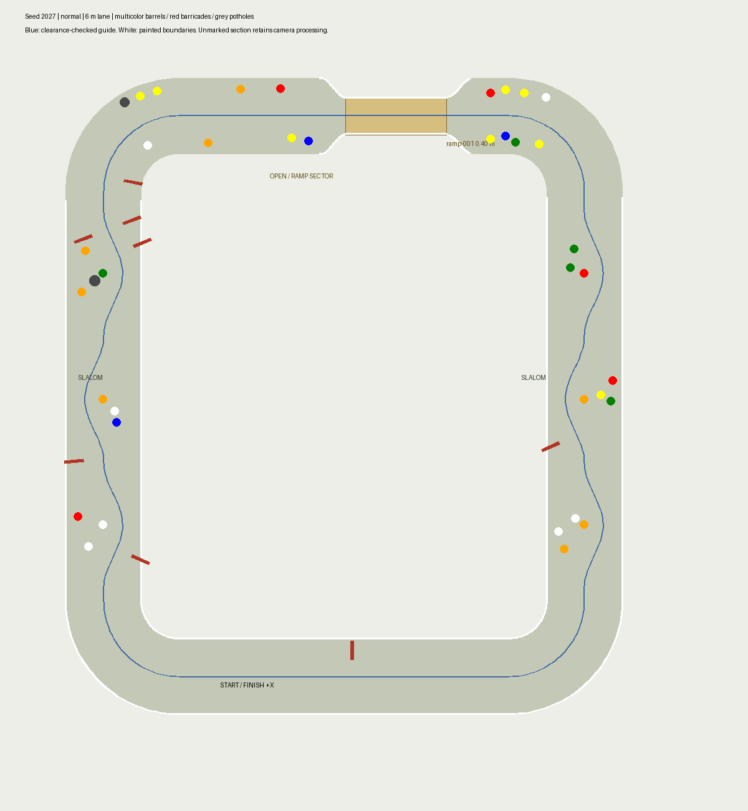
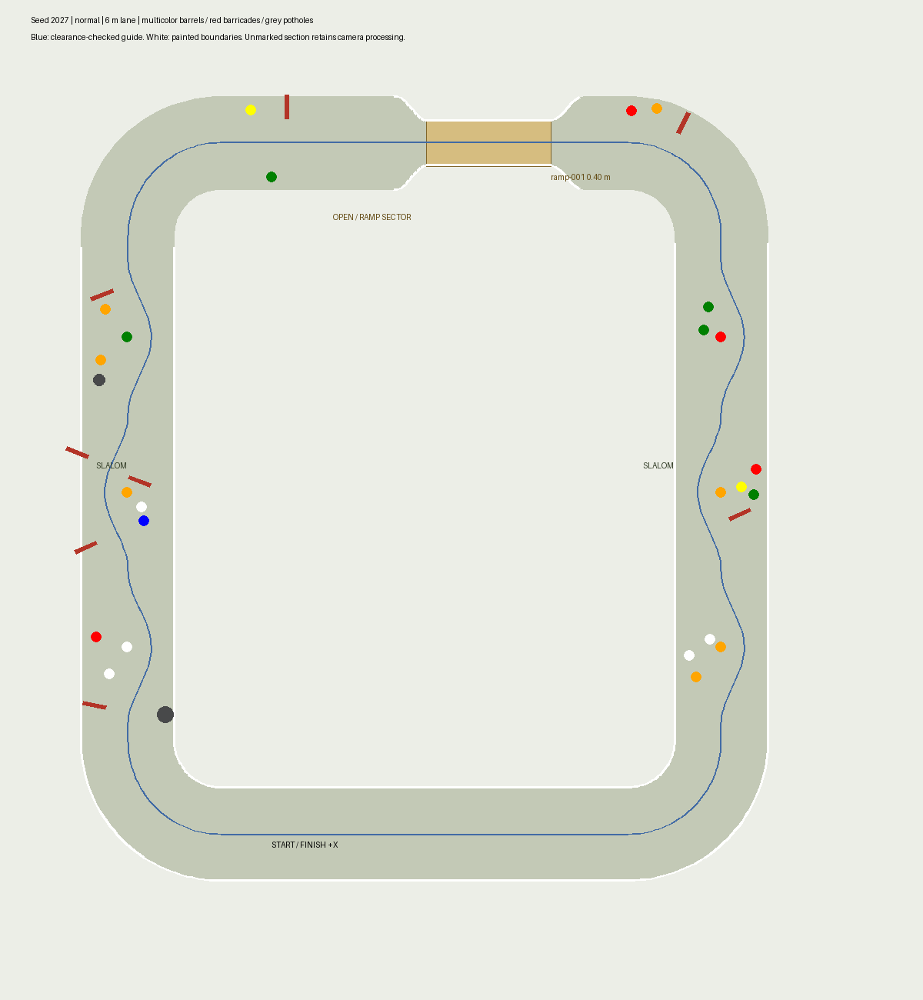
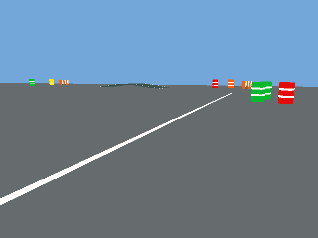

# Reference-inspired sectors and colored barrels

The user-supplied course photograph replaces the earlier interpretation of
"barrels anywhere". Connecting-sector obstacles occupy the driving corridors;
the September 17 annotated screenshot places open-sector barrels in outer bands.
This is a procedural practice layout inspired by the reference, not a surveyed
reconstruction or a statement of IGVC 2027 rule compliance.

- A rounded loop keeps a clear start straight.
- Two connecting sectors contain alternating barrel groups. Six barrels obstruct
  unshifted centerline traversal; the clearance-checked guide weaves around them.
- An open sector opposite the start contains random barrels and barricades.
  Both white boundaries continue around the end bends, matching the red-marked
  extensions in the user's September 16 screenshot. Paint then ends on the
  straight ramp approaches and resumes around the opposite bend after the exit.
  The latest generator places 24 barrels in two broad outer bands on normal
  difficulty: six on each lateral side before the ramp midpoint and six on each
  side after it. Each band extends from near one painted lane mouth to the other,
  including alongside the ramp itself. Barrel centres sit 4–5 m to either side
  of the sector centreline, matching the red dashed bands in the screenshot.
  Easy has 16 (four per zone), hard has 28 (seven per zone). Positions and colors
  remain seeded and randomized, with longitudinal sampling spread through each
  zone. Normal has 44 barrels overall; connecting-sector counts are retained.
  Barrel extents leave at least 7.4 m between the two bands and at least 0.7 m
  longitudinal clearance from the two outside painted lane mouths. An exact
  segment-distance check also preserves 0.7 m from existing curved paint. The ramp and
  existing white paint are unchanged; the outer bands do not add white paint. Full
  obstacle overlap and swept guide-clearance checks still gate every placement.
  The sequence is painted lane → open barrel area → white-edged ramp
  → open barrel area → painted lane.
- The ramp retains white paint along both edges. Its painted section separates
  the two gaps; mission perception modes no longer merge them into one interval.
  Its midpoint is centered between the two side-lane centerlines for every seed;
  the painted tapers, obstacle reservation and guided regression checkpoints
  move with it. The two open barrel approaches have equal available width.
- Barrel colors are seeded red, orange, blue, green, yellow and white. Legacy
  manifests without a color still render orange. White barrels use dark rings;
  other colors use white rings. Colors are appearance, not navigation commands.
- The updated seed-2027 generator produces 30 guide goals, versus 31 in the
  preceding layout and 82 in the original dense mission. The dense guide
  remains available to the physical lap audit; it is distinct from lane geometry.

The generator proves a clearance-checked alternating guide, not uniqueness of
that path. It still uses known geometry to author guidance goals, so this fixture
does not prove general autonomous discovery of an unknown competition course.

## Validation

### Balanced outer-band generator update

The new counts and four-zone distribution are generator changes. Regeneration
of the canonical manifests and live execution must be validated separately;
the older 16-barrel run below does not establish success for this layout.
All 14 generator geometry tests passed, including balanced outer-band placement,
ramp-side coverage and mouth reservations for six seeds across all three difficulties. Independent overlap,
route-footprint, boundary, and ramp checks remain enabled. For seed 2027 normal,
the generated conservative obstacle clearance is 0.360 m and painted-boundary
clearance is 0.537 m. These are geometric checks, not runtime measurements.

### Denser ramp approaches

The clarified 16-barrel open sector passed all 13 geometry tests, followed by an
uninterrupted 31/31 lap with all 12 [audit checks](evidence/dense-ramp/audit.json)
passing. Minimum sampled clearance was 0.307 m and conservative swept clearance
0.211 m; no resets, recording gaps or line interventions. The initial Nav2
startup encountered a lifecycle service timeout and the startup sensor-rate
check failed; after a ROS container restart, navigation became active and all
seven [integration checks](evidence/dense-ramp/integration.json) passed before
the successful lap. No Unity code changes or player rebuild were needed for
this manifest-only density adjustment. Earlier results below refer to the
four-barrel open sector.

### Initial sector layout

Geometry: 13 tests passed on Ubuntu across multiple seeds/difficulties, including
barrel coverage, obstruction of unshifted traversal, alternating passage,
footprint clearance, separate gaps, ramp paint and sparse goals.

Perception: 17 RGB tests passed for colored barrel stripes and shadows, including
paint touching stripes. The saturated-color heuristic remains fixture-specific;
colored ground can confuse it. White barrel surfaces rely on depth eligibility
for lane rejection, and their dark rings can remain hazard candidates.

Unity Windows build passed with 3 rendered ground fixtures, 6 depth checks,
70 ramp checks and 12 caster checks. Linux player rebuild/runtime validation was
not performed in this slice.

Windows Unity/Docker Jazzy completed a fresh uninterrupted 31/31 lap and passed
all 12 [route-audit checks](evidence/reference-course/audit.json). No resets,
recording gaps or line interventions; maximum speed 2.2 m/s. Minimum sampled
obstacle clearance was 0.277 m, with conservative swept bound 0.141 m.

The initial debugging lap paused at the ramp exit. A 3 m camera transition buffer
now switches to unpainted mode before nearby paint disappears, while the middle
of the ramp remains painted. Planning requests limit extra goals to 8.5 m, and
resume reapplies the perception mode reset by cleanup. Three mission-mode tests
pass. Debugging pauses are not counted as an uninterrupted success.

The startup transport check failed its rate threshold; timestamps, payloads and
TF passed. That [startup result](evidence/reference-course/startup-integration.json)
is retained. The subsequent [warmed-up check](evidence/reference-course/integration.json)
passed all seven checks (RGB 11.44 Hz, depth 7.89 Hz, scan 4.49 Hz). Runtime
camera imagery was visually inspected for colored barrels. Docker was rebuilt
with the final scripts.

